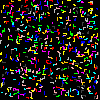

# Game Level Generator

This project contains two Java scripts designed for creating and modifying game levels. It allows for the generation of levels using predefined shapes and colors, including functionalities like shape rotation, collision detection, and level visualization.

## Scripts Overview

### `LevelCreate.java`

- Reads an image (noise texture on a black background) and converts it into a 2D array representing the level.
- Simplifies the level by removing isolated pixels and small disconnected segments.
- Saves the refined level as an image for visualization.
  
  Input:
  
  Output:
  

### `LevelCreate2.java`

- Defines several shapes for level construction.
- Places and rotates these shapes randomly across the level grid without overlaps.
- Visualizes the generated level as an image.
  
  
